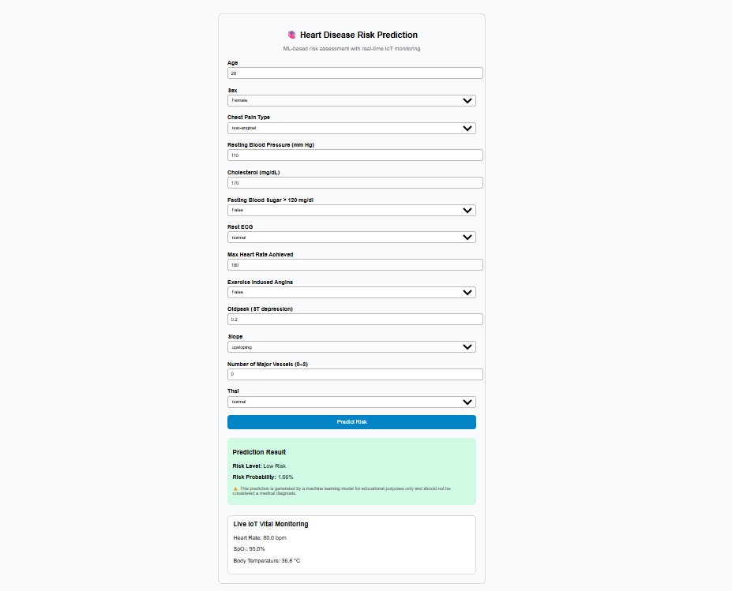

# 🫀 Cardiac Arrest Prediction System

A Machine Learning and IoT-based web application that predicts cardiac arrest risk using medical parameters and displays real-time physiological data from IoT sensors via ThingSpeak cloud integration.

---

## 📌 Overview

The **Cardiac Arrest Prediction System** is a web-based healthcare application that predicts the risk of cardiac arrest using machine learning algorithms and patient health parameters.

The system also integrates **IoT-based health monitoring** by retrieving real-time physiological data such as heart rate, oxygen saturation, and body temperature from IoT sensors through the **ThingSpeak cloud platform**.

This project demonstrates the integration of:

- Machine Learning for health risk prediction
- IoT sensors for real-time physiological monitoring
- Cloud data retrieval using APIs
- Web application development using Django

---

## 🚀 Live Demo

🔗 https://cardiac-arrest-predictor.onrender.com

---

## 🧠 Machine Learning Model

The system uses a **Logistic Regression model** trained on the **UCI Heart Disease dataset**.

### Model Performance

```
| Metric    |  Value |
|-----------|--------|
| Accuracy  | 80.43% |
| Precision | 86.13% |
| Recall    | 79.82% |
| F1 Score  | 82.86% |
| ROC-AUC   | 0.889  |
```

---

## ⚙️ Features

-  Heart disease risk prediction using Machine Learning  
-  Probability-based risk classification (Low / Moderate / High)  
-  Django-based backend API for prediction  
-  Real-time IoT sensor monitoring via ThingSpeak cloud  
-  Data preprocessing with scaling and missing value handling  
-  Simple web interface for entering medical parameters  
-  Deployed cloud application accessible from anywhere  

---

## 📡 IoT Integration

The system retrieves real-time physiological data from IoT sensors connected to the **ThingSpeak cloud platform**.

### Vital parameters monitored:

- Heart Rate (bpm)
- Oxygen Saturation (SpO₂ %)
- Body Temperature (°C)

### Data Flow

```
IoT Sensors
     ↓
Microcontroller
     ↓
ThingSpeak Cloud
     ↓
Django Backend API
     ↓
Web Application UI
```

---

## 📊 Risk Prediction Categories

The predicted probability is classified into three categories:

```
| Risk Probability |    Risk Level  |
|------------------|--------------- |
|    0% – 40%      |  Low Risk      |
|    40% – 70%     |  Moderate Risk |
|    70% – 100%    |  High Risk     |
```

---

## 🖥 Application Interface



---

## 🛠 Tech Stack

### Backend
- Python
- Django
- Django REST API

### Machine Learning
- Scikit-learn
- Pandas
- NumPy

### Frontend
- HTML
- CSS
- JavaScript

### IoT & Cloud
- IoT Sensors
- ThingSpeak Cloud API

### Deployment
- Render
- Gunicorn

---

## 📂 Project Structure

```
cardiac-arrest-prediction-system
│
├── backend
│ ├── cardiac_predictor
│ │ ├── settings.py
│ │ ├── urls.py
│ │ └── wsgi.py
│ │
│ ├── predictor
│ │ ├── views.py
│ │ ├── utils.py
│ │ ├── urls.py
│ │ └── templates
│ │
│ └── manage.py
│
├── ml
│ ├── train_model.py
│ ├── models
│ │ ├── best_model.pkl
│ │ ├── scaler.pkl
│ │ ├── imputer.pkl
│ │ └── feature_columns.pkl
│
├── screenshots
│ └── project-interface.png
│
├── requirements.txt
└── README.md
```

---

## 🔧 Installation

### 1️⃣ Clone Repository

```
git clone https://github.com/salmashaik45/cardiac-arrest-prediction-system.git

cd cardiac-arrest-prediction-system
```

---

### 2️⃣ Create Virtual Environment

```
python -m venv venv
```

Activate environment

### Windows:

```
venv\Scripts\activate
```

### Mac/Linux:

```
source venv/bin/activate
```

---

### 3️⃣ Install Dependencies

```
pip install -r requirements.txt
```

---

### 4️⃣ Run the Server

```
cd backend
python manage.py runserver
```

Open in browser:

```
http://127.0.0.1:8000
```

---

## 📊 Dataset

The machine learning model was trained using the **UCI Heart Disease Dataset**, which includes clinical attributes such as:

- Age
- Sex
- Chest Pain Type
- Resting Blood Pressure
- Cholesterol
- Fasting Blood Sugar
- Rest ECG
- Maximum Heart Rate
- Exercise Induced Angina
- ST Depression (Oldpeak)
- Slope
- Number of Major Vessels
- Thalassemia

---

## 📈 Future Improvements

- Integration with wearable health devices
- Real-time ECG signal analysis
- Mobile application interface
- Deep learning based prediction models
- Alert system for high-risk patients

---

## 👩‍💻 Author

**Salma Shaik**  
Computer Science and Engineering Student  

🔗 GitHub: https://github.com/salmashaik45

---

## 📜 License

This project is developed for educational and research purposes.